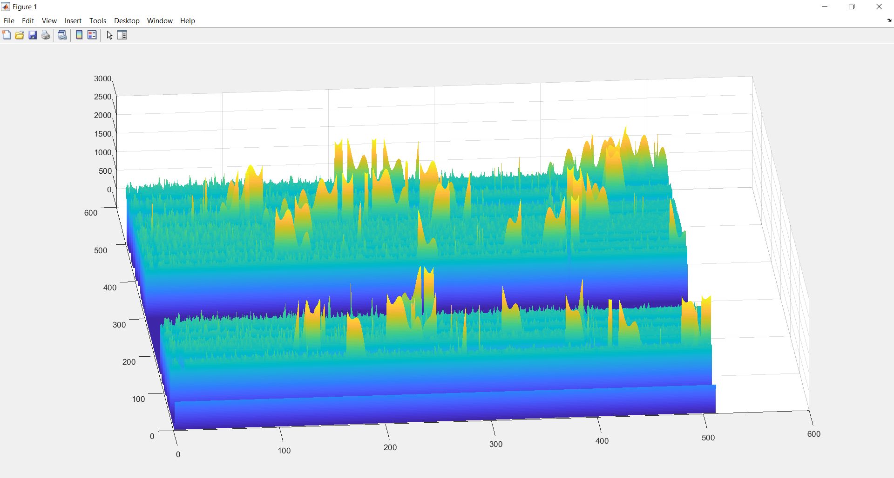

# Scanning-Tunneling-Microscope

In first year, we were given a challenge to design and build a scanning tunnelling microscope with limited parts and limited guidance. 

[!(http://img.youtube.com/vi/Xzelec5LNmc/0.jpg)](http://www.youtube.com/watch?v=Xzelec5LNmc "")
