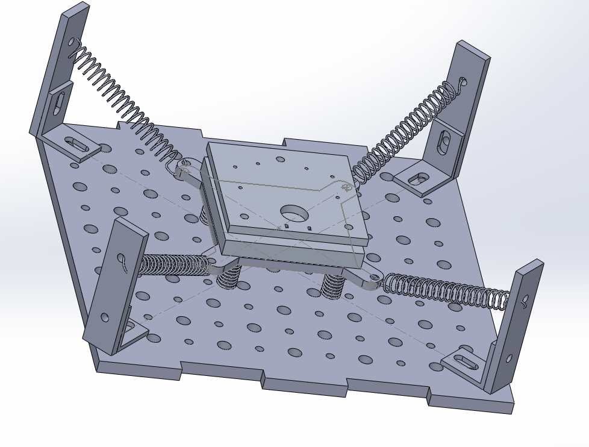
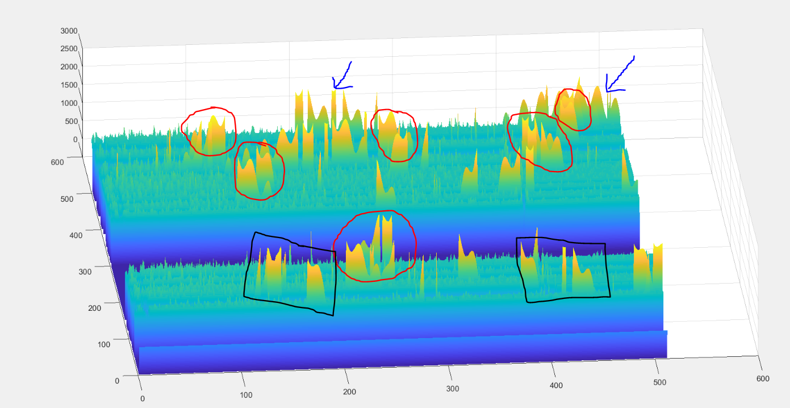

# Scanning-Tunneling-Microscope

Summary
=

In first year, we were given a challenge to design and build a Scanning Tunnelling Microscope (STM) with limited parts and limited guidance. This challenge was comprised of multiple steps, including:

 - Planning and creating a vibration isolation system to dampen ambient micro- and nano-scale vibrations to allow for less noisy measurements
 
 - Creating a piezo disk to mount the STM tip onto
 
 - Taking advantage of redox reactions to create a tungsten tip for the STM which is sharp on the nano-scale
 
 - Using CAD software to model the STM setup
 
 - Conducting tests to obtain the surface topography of a CD
 
 - Data analysis using MATLAB to view the results

Overall, we were awarded best design and our group was the only one able to actually obtain somewhat clear data, as shown in the photo below. In this photo, all the axes are in nanometers. Sinusoidal noise is very evident in this data, likely due to the AC signal used in the STM setup.

Vibration isolation
=

When creating a vibration isolation system, we were only allowed to use a small variety of parts due to the nature of the design challenge. We were allowed to use acrylic plates (which could be laser-cut to our specifications) as well as a handful of tension springs and a very small selection of compression springs. We also used rubber strips and hot glue. Without the restraints on building materials our design would have differed greatly, but we had to make do. In the end, our design worked very well and was able to quickly dampen even massive vibrations, as shown in <a href="http://www.youtube.com/watch?v=Xzelec5LNmc">this video</a>.

Creating the STM tip
=

To create our STM tip, we placed a tungsten anode and a graphite cathode partially submerged in a NaOH solution and used a redox reaction to slowly ionize the tungsten, which would then be depositen onto the graphite in its redox reaction. After a period of time, the tungsten inside the solution was very thin at the meniscus but not so thin everywhere else. Eventually, the portion of tungsten submerged in the solution fell off due to the portion at the meniscus being too thin to support the weight of the submerged portion. The tungsten which was not submerged was then removed and analyzed, and was sharp on the nanoscale (see the following photo). This tip needs to be exceptionally sharp - this will be what rasterizes over the sample, and quantum tunnelling currents travelling through it will be used to measure the height of the topography of the sample.

Using CAD software to model the STM setup
=

We used SolidWorks to model the vibration isolation system before we assembled it. Below is a photo of the CAD:

Testing the STM
=

With the assistance of a professor, we placed the STM tip on the piezo disk and wired everything together. We then proceeded to use software to control the voltages on the piezo disk to rasterize over the CD sample to obtain its topography. This raw data is available in STM_Scan.tif.

Data Analysis
=

Using MATLAB, we interpreted our results using a 3D graph. Filtering out all bad values (where the STM was unable to get a true tunnelling current), we finally obtained the data as seen in the first photo. This data shows that our STM did actually work as intended (with the largest source of noise being sinusoidal from the signal generator itself). In the following photo, there is a small amount of noise at the start of the sample (shown by blue arrows). When reading the sample, the tip started in the upper right corner and moved to the left, moving in a snake pattern across the entire sample. As shown in the red circles, there are multiple areas where 3D topography is reported many times - this is indicative of actual 3D features on the CD - proving that the STM worked. Near the end of the rasterization, there are still features reported multiple times but they are offset by a certain amount each (shown by the black boxes). These still show 3D features, but due to a software error they are not shown in the correct place.

Overall, our STM won best overall design for a few reasons, including the fact that our vibration isolation worked well and that our STM was able to obtain realistic data of the topography of a CD.
